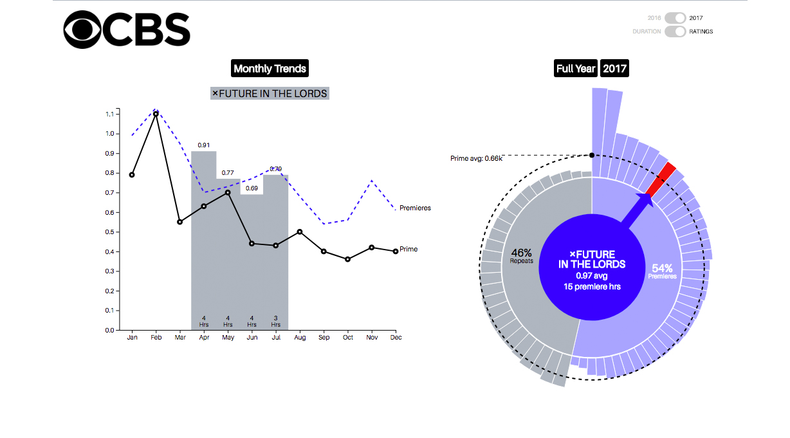

A data visualization tool designed to help those in the TV business understand the performance drivers for a variety of networks. Please note that all networks, shows and data has been randomized for public display. A key feature of the application is "STORY MODE", which walks users through a series of pre-programmed bullet points/observations while highlighting pertinent information in the visual elements. The STORY MODE can be programmed by data analysts to give less data-savvy users a more curated and meaningful experience, helping them to better understand the underlying data and its effect on the oveall total performance of a network.

[link](http://rockthecatzva.com/yearly-tv-review/) | [github](https://github.com/rockthecatzva/tvratings_end_of_year_interactive)

